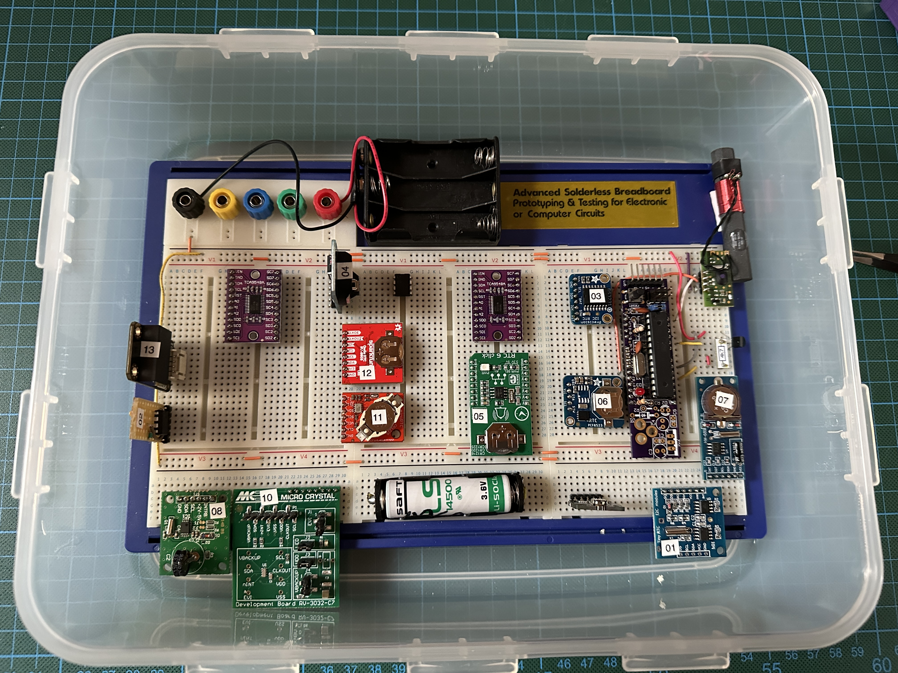

# RTCEval

This is a long-term experiment running thirteen RTCs for some time in order to see how they live up to their specifications. 

Ground truth is delivered by a DCF77 receiver and the deviation is measured in msecs every day at midnight. In addition, temperature is measured every hour. All that is stored in a serial EEPROM with space for 1024 days. The plan is to let the experiment for a year or two. 

The RTCs that will participate are:

* DS1307,

* DS1337,

* DS3231SN,

* DS3231M,

* MCP79410, 

* PCF8523,

* PCF8563,

* RS5C372,

* RV-3028, 

* RV-3032, 

* RV-8523,

* RV-8803, and

* SD2405. 

This is how it looks before I started to connect the RTCs to the I2C multiplexers and the MCU.

  

